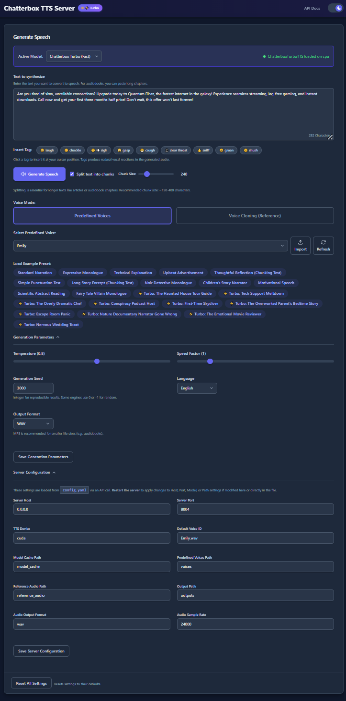
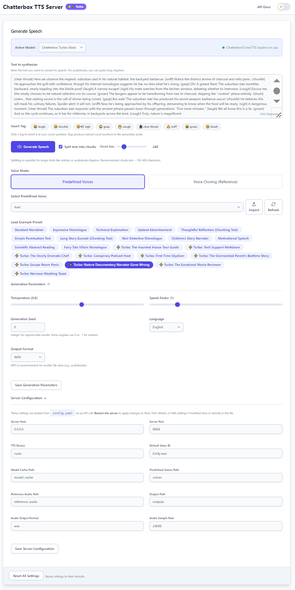

# Chatterbox TTS Server: OpenAI-Compatible API with Web UI, Large Text Handling & Built-in Voices

**Self-host Resemble AI's [Chatterbox](https://github.com/resemble-ai/chatterbox) open-source TTS family (Original + Multilingual + Turbo) behind an OpenAI‑compatible API and a modern Web UI. The complete lineup includes the original high-quality model, multilingual support for 23 languages, and Chatterbox‑Turbo—a streamlined 350M-parameter model with dramatically improved throughput and native paralinguistic tags like `[laugh]`, `[cough]`, and `[chuckle]` for more expressive voice agents and narration. Features voice cloning, large text processing via intelligent chunking, audiobook generation, and consistent, reproducible voices using built-in ready-to-use voices and a generation seed feature.**

> 🚀 **Try it now!** Test the full TTS server with voice cloning and audiobook generation in Google Colab - no installation required! To use it, please run cells 1 through 4 one at a time. After running cell 4, click on the "https://localhost:8004" link that appears in the output, and your web browser will open the UI from the .colab.dev domain. Read the instructions [here](https://github.com/devnen/Chatterbox-TTS-Server/blob/main/README_Colab.md).
> 
> [](https://colab.research.google.com/github/devnen/Chatterbox-TTS-Server/blob/main/Chatterbox_TTS_Colab_Demo.ipynb)

This server is based on the architecture and UI of our [Dia-TTS-Server](https://github.com/devnen/Dia-TTS-Server) project but uses the distinct `chatterbox-tts` engine. Runs accelerated on NVIDIA (CUDA), AMD (ROCm), and Apple Silicon (MPS) GPUs, with a fallback to CPU. Make sure you also check our [Kitten-TTS-Server](https://github.com/devnen/Kitten-TTS-Server) project.

[](https://github.com/devnen/Chatterbox-TTS-Server)
[](LICENSE)
[](https://www.python.org/downloads/)
[](https://fastapi.tiangolo.com/)
[](https://github.com/resemble-ai/chatterbox)
[](https://www.docker.com/)
[](#)
[](https://developer.nvidia.com/cuda-zone)
[](https://rocm.docs.amd.com/)
[](https://developer.apple.com/metal/)
[](https://platform.openai.com/docs/api-reference)
[](https://colab.research.google.com/github/devnen/Chatterbox-TTS-Server/blob/main/Chatterbox_TTS_Colab_Demo.ipynb)

<div align="center">
  
  
</div>

> 📦 **Portable Mode (Windows):** This application supports a fully portable installation — the entire folder, including Python and all dependencies, is self-contained. Copy it to a USB drive, share it as a zip, or move it anywhere. Just double-click `start.bat` — no Python installation needed on the target machine. [Learn more →](#-portable-mode-windows)

---

## 🆕 What's New

### 📦 Portable Mode for Windows (new)

- The launcher now offers **Portable Mode** for all Windows users during first-time setup — selected by default.
- Creates a fully self-contained installation: the entire project folder can be **copied to a USB drive**, **zipped and shared**, or **moved anywhere** on the filesystem.
- The recipient just double-clicks `start.bat` — **no Python installation required** on the target machine.
- Works with any system Python 3.10 or newer. On Python 3.11+, Portable Mode also resolves dependency compatibility issues automatically.
- Use `--portable` to skip the prompt and install in portable mode directly, or `--no-portable` for a standard virtual environment.
- Linux and macOS continue to use standard virtual environments, which work reliably on those platforms.

### 🌍 Chatterbox Multilingual support (new)

- Added full support for **Chatterbox Multilingual**, completing support for all three models in Resemble AI's Chatterbox family.
- Multilingual brings **23-language support** including Arabic, Chinese, Danish, Dutch, English, Finnish, French, German, Greek, Hebrew, Hindi, Italian, Japanese, Korean, Malay, Norwegian, Polish, Portuguese, Russian, Spanish, Swedish, Swahili, and Turkish.
- Built on the same **0.5B-parameter architecture** as the original Chatterbox with emotion exaggeration control and zero-shot voice cloning.
- Perfect for international projects, multilingual audiobooks, and voice agents serving global audiences.

### ⚡ Chatterbox‑Turbo support (new)

- Added full support for **Chatterbox‑Turbo**, Resemble AI's latest efficiency-focused Chatterbox model.
- Turbo is built on a **streamlined 350M‑parameter architecture**, designed to use less compute/VRAM while keeping high-fidelity output.
- Turbo distills the speech-token-to-mel "audio diffusion decoder" from **10 steps → 1 step**, removing a major inference bottleneck.
- Resemble positions Turbo for real-time/agent workflows and highlights significantly faster-than-real-time performance on GPU (performance varies by hardware/settings).

### 🔁 Hot‑swappable TTS engines (UI)

- Added a new **engine selector** dropdown at the top of the Web UI.
- Instantly hot-swap between **Original Chatterbox**, **Chatterbox Multilingual**, and **Chatterbox‑Turbo**; the backend auto-loads the selected engine.
- All three models are **hot-swappable**—simply select from the dropdown and the backend automatically loads your choice without requiring restarts or configuration changes.
- All UI + API requests route through the active engine so you can A/B test quality, language support, and latency without changing client code.

### 🎭 Paralinguistic tags (Turbo)

- Turbo adds **native paralinguistic tags** you can write directly into your text, e.g. `…calling you back [chuckle]…`.
- Supported tags include `[laugh]`, `[cough]`, and `[chuckle]`, plus text-based prompting for reactions like sigh, gasp, and cough.
- Added **new presets** in `ui/presets.yaml` demonstrating paralinguistic prompting for agent-style scripts and expressive reads.

### ✅ Original Chatterbox remains first‑class

- The original Chatterbox model remains available, with support for high quality English language output, a **0.5B LLaMA backbone**, **emotion exaggeration control**, and training on **0.5M hours** of cleaned data.

### 🎯 Complete Chatterbox family support

**You now have access to the entire Chatterbox lineup:**
- **Original Chatterbox** — High-quality English output with emotion control (0.5B parameters, 0.5M hours training data)
- **Chatterbox Multilingual** — 23-language support with voice cloning and emotion control (0.5B parameters)
- **Chatterbox Turbo** — Fastest inference with paralinguistic tags like `[laugh]` and `[cough]` (350M parameters, 1-step diffusion)

**Switching models is effortless:** Simply select your preferred model from the engine selector dropdown at the top of the Web UI. No restarts, no configuration changes required—just instant hot-swapping to test quality, speed, and language support across the complete Chatterbox family.

### 🖥️ New NVIDIA / CUDA support

- Updated to support **NVIDIA CUDA 12.8** and **RTX 5090 / Blackwell** generation GPUs.

### 🧰 Automated launcher + easy updates

- New **Automated Launcher** (Windows + Linux) that creates/activates a venv, installs the right dependencies, downloads model files, starts the server, and opens the Web UI.
- Easy maintenance commands:
  - `--upgrade` to update code + dependencies.
  - `--reinstall` for a clean reinstall when environments get messy.

---

## 🗣️ Overview: Enhanced Chatterbox TTS Generation

The [Chatterbox TTS model by Resemble AI](https://github.com/resemble-ai/chatterbox) provides capabilities for generating high-quality speech. This project builds upon that foundation by providing a robust [FastAPI](https://fastapi.tiangolo.com/) server that makes Chatterbox significantly easier to use and integrate.

**🚀 Want to try it instantly?** [Launch the live demo in Google Colab](https://colab.research.google.com/github/devnen/Chatterbox-TTS-Server/blob/main/Chatterbox_TTS_Colab_Demo.ipynb) - no installation needed!

The server expects plain text input for synthesis and we solve the complexity of setting up and running the model by offering:

*   A **modern Web UI** for easy experimentation, preset loading, reference audio management, and generation parameter tuning.
*   **Multi-engine support (Original + Turbo):** Choose the TTS engine directly in the Web UI, then generate via the same UI/API surface.
*   **Paralinguistic prompting (Turbo):** Native tags like `[laugh]`, `[cough]`, and `[chuckle]` for natural non-speech reactions inside the same generated voice.
*   **Original Chatterbox strengths:** High quality English output plus unique "emotion exaggeration control" and 0.5B LLaMA backbone.
*   **Multi-Platform Acceleration:** Full support for **NVIDIA (CUDA)**, **AMD (ROCm)**, and **Apple Silicon (MPS)** GPUs, with an automatic fallback to **CPU**, ensuring you can run on any hardware.
*   **Large Text Handling:** Intelligently splits long plain text inputs into manageable chunks based on sentence structure, processes them sequentially, and seamlessly concatenates the audio.
*   **📚 Audiobook Generation:** Perfect for creating complete audiobooks - simply paste an entire book's text and the server automatically processes it into a single, seamless audio file with consistent voice quality throughout.
*   **Predefined Voices:** Select from curated, ready-to-use synthetic voices for consistent and reliable output without cloning setup.
*   **Voice Cloning:** Generate speech using a voice similar to an uploaded reference audio file.
*   **Consistent Generation:** Achieve consistent voice output across multiple generations or text chunks by using the "Predefined Voices" or "Voice Cloning" modes, optionally combined with a fixed integer **Seed**.
*   **Docker support** for easy, reproducible containerized deployment on any platform.

This server is your gateway to leveraging Chatterbox's TTS capabilities seamlessly, with enhanced stability, voice consistency, and large text support for plain text inputs.

## ✨ Key Features of This Server

**🔥 Live Demo Available:**
*   **🚀 [One-Click Google Colab Demo](https://colab.research.google.com/github/devnen/Chatterbox-TTS-Server/blob/main/Chatterbox_TTS_Colab_Demo.ipynb):** Try the full server with voice cloning and audiobook generation instantly in your browser - no local installation required!

This server application enhances the underlying `chatterbox-tts` engine with the following:

**🚀 Core Functionality:**

*   **Multi-Engine Support:**
    *   Choose between **Original Chatterbox**, **Chatterbox Multilingual**, and **Chatterbox‑Turbo** via a hot-swappable engine selector in the Web UI.
    *   **Original Chatterbox** provides high-quality English output with emotion exaggeration control (0.5B parameters).
    *   **Chatterbox Multilingual** offers 23-language support with voice cloning and emotion control (0.5B parameters).
    *   **Chatterbox Turbo** delivers significantly faster inference with a streamlined 350M-parameter architecture and paralinguistic tags.
    *   All three models are hot-swappable—simply select from the dropdown without restarts or config changes.
*   **Paralinguistic Tags (Turbo):**
    *   Write native tags like `[laugh]`, `[cough]`, and `[chuckle]` directly in your text when using Chatterbox‑Turbo.
    *   New presets demonstrate paralinguistic prompting for agent-style scripts and expressive narration.
*   **Large Text Processing (Chunking):**
    *   Automatically handles long plain text inputs by intelligently splitting them into smaller chunks based on sentence boundaries.
    *   Processes each chunk individually and seamlessly concatenates the resulting audio, overcoming potential generation limits of the TTS engine.
    *   **Ideal for audiobook generation** - paste entire books and get professional-quality audiobooks with consistent narration.
    *   Configurable via UI toggle ("Split text into chunks") and chunk size slider.
*   **Predefined Voices:**
    *   Allows usage of curated, ready-to-use synthetic voices stored in the `./voices` directory.
    *   Selectable via UI dropdown ("Predefined Voices" mode).
    *   Provides reliable voice output without manual cloning setup.
*   **Voice Cloning:**
    *   Supports voice cloning using a reference audio file (`.wav` or `.mp3`).
    *   The server processes the reference audio for the engine.
*   **Generation Seed:** Added `seed` parameter to UI and API for influencing generation results. Using a fixed integer seed *in combination with* Predefined Voices or Voice Cloning helps maintain consistency.
*   **API Endpoint (`/tts`):**
    *   The primary API endpoint, offering fine-grained control over TTS generation.
    *   Supports parameters for text, voice mode (predefined/clone), reference/predefined voice selection, chunking control (`split_text`, `chunk_size`), generation settings (temperature, exaggeration, CFG weight, seed, speed factor, language), and output format.
*   **UI Configuration Management:** Added UI section to view/edit `config.yaml` settings (server, model, paths) and save generation defaults.
*   **Configuration System:** Uses `config.yaml` for all runtime configuration, managed via `config.py` (`YamlConfigManager`). If `config.yaml` is missing, it's created with default values from `config.py`.
*   **Audio Post-Processing (Optional):** Includes utilities for silence trimming, internal silence reduction, and (if `parselmouth` is installed) unvoiced segment removal to improve audio quality. These are configurable.
*   **UI State Persistence:** Web UI now saves/restores text input, voice mode selection, file selections, and generation parameters (seed, chunking, sliders) in `config.yaml` (`ui_state` section).

**🔧 General Enhancements:**

*   **Easy Installation & Management:**
    *   🚀 **Automated Launcher** (`start.bat` / `start.sh`) - One-command setup with automatic hardware detection
    *   🔧 **Multiple GPU Support** - NVIDIA CUDA 12.1, NVIDIA CUDA 12.8 (Blackwell), AMD ROCm, Apple MPS
    *   🔄 **Easy Updates** - Simple `--upgrade` and `--reinstall` commands
    *   📦 **Portable Mode (Windows)** - Self-contained, movable installation — copy to USB, share as zip, run anywhere without Python
    *   🎯 **Skip Menu Options** - Direct installation with `--cpu`, `--nvidia`, `--nvidia-cu128`, `--rocm`, `--portable` flags
*   **Performance:** Optimized for speed and efficient VRAM usage on GPU.
*   **Web Interface:** Modern, responsive UI for plain text input, parameter adjustment, preset loading, reference/predefined audio management, and audio playback.
*   **Model Loading:** Uses `ChatterboxTTS.from_pretrained()` for robust model loading from Hugging Face Hub, utilizing the standard HF cache.
*   **Dependency Management:** Clear `requirements.txt`.
*   **Utilities:** Comprehensive `utils.py` for audio processing, text handling, and file management.

## ✅ Features Summary

*   **Core Chatterbox Capabilities (via [Resemble AI Chatterbox](https://github.com/resemble-ai/chatterbox)):**
    *   🗣️ High-quality single-speaker voice synthesis from plain text.
    *   🎤 Perform voice cloning using reference audio prompts.
    *   🎯 **Complete model family:** Original Chatterbox (English, emotion control), Chatterbox Multilingual (23 languages), and Chatterbox‑Turbo (fastest, paralinguistic tags).
    *   🔄 **Hot-swappable engines:** Switch between all three models instantly via dropdown—no restarts needed.
*   **Enhanced Server & API:**
    *   ⚡ Built with the high-performance **[FastAPI](https://fastapi.tiangolo.com/)** framework.
    *   ⚙️ **Custom API Endpoint** (`/tts`) as the primary method for programmatic generation, exposing all key parameters.
    *   📄 Interactive API documentation via Swagger UI (`/docs`).
    *   🩺 Health check endpoint (`/api/ui/initial-data` also serves as a comprehensive status check).
*   **Advanced Generation Features:**
    *   🔁 **Hot-Swappable Engines:** Switch between Original Chatterbox, Chatterbox Multilingual, and Chatterbox‑Turbo directly in the Web UI—no restarts required.
    *   🌍 **Multilingual Support:** 23 languages including Arabic, Chinese, French, German, Japanese, Spanish, and more via Chatterbox Multilingual.
    *   🎭 **Paralinguistic Tags (Turbo):** Native support for `[laugh]`, `[cough]`, `[chuckle]` and other expressive tags.
    *   📚 **Large Text Handling:** Intelligently splits long plain text inputs into chunks based on sentences, generates audio for each, and concatenates the results seamlessly. Configurable via `split_text` and `chunk_size`.
    *   📖 **Audiobook Creation:** Perfect for generating complete audiobooks from full-length texts with consistent voice quality and automatic chapter handling.
    *   🎤 **Predefined Voices:** Select from curated synthetic voices in the `./voices` directory.
    *   ✨ **Voice Cloning:** Simple voice cloning using an uploaded reference audio file.
    *   🌱 **Consistent Generation:** Use Predefined Voices or Voice Cloning modes, optionally with a fixed integer **Seed**, for consistent voice output.
    *   🔇 **Audio Post-Processing:** Optional automatic steps to trim silence, fix internal pauses, and remove long unvoiced segments/artifacts (configurable via `config.yaml`).
*   **Intuitive Web User Interface:**
    *   🖱️ Modern, easy-to-use interface.
    *   🔁 **Engine Selector:** Hot-swap between Original Chatterbox, Chatterbox Multilingual, and Chatterbox‑Turbo with a simple dropdown—no restarts needed.
    *   💡 **Presets:** Load example text and settings dynamically from `ui/presets.yaml`.
    *   🎤 **Reference/Predefined Audio Upload:** Easily upload `.wav`/`.mp3` files.
    *   🗣️ **Voice Mode Selection:** Choose between Predefined Voices or Voice Cloning.
    *   🎛️ **Parameter Control:** Adjust generation settings (Temperature, Exaggeration, CFG Weight, Speed Factor, Seed, etc.) via sliders and inputs.
    *   💾 **Configuration Management:** View and save server settings (`config.yaml`) and default generation parameters directly in the UI.
    *   💾 **Session Persistence:** Remembers your last used settings via `config.yaml`.
    *   ✂️ **Chunking Controls:** Enable/disable text splitting and adjust approximate chunk size.
    *   ⚠️ **Warning Modals:** Optional warnings for chunking voice consistency and general generation quality.
    *   🌓 **Light/Dark Mode:** Toggle between themes with preference saved locally.
    *   🔊 **Audio Player:** Integrated waveform player ([WaveSurfer.js](https://wavesurfer.xyz/)) for generated audio with download option.
    *   ⏳ **Loading Indicator:** Shows status during generation.
*   **Flexible & Efficient Model Handling:**
    *   ☁️ Downloads models automatically from [Hugging Face Hub](https://huggingface.co/) using `ChatterboxTTS.from_pretrained()`.
    *   🔄 Easily specify model repository via `config.yaml`.
    *   📄 Optional `download_model.py` script available to pre-download specific model components to a local directory (this is separate from the main HF cache used at runtime).
*   **Performance & Configuration:**
    *   💻 **GPU Acceleration:** Automatically uses NVIDIA CUDA, Apple MPS, or AMD ROCm if available, falls back to CPU.
    *   ⚙️ All configuration via `config.yaml`.
    *   📦 Uses standard Python virtual environments.
    *   📦 **Portable Mode (Windows):** Self-contained installation that can be copied, moved, or shared — no Python needed on the target machine.
*   **Docker Support:**
    *   🐳 Containerized deployment via [Docker](https://www.docker.com/) and Docker Compose.
    *   🔌 NVIDIA GPU acceleration with Container Toolkit integration.
    *   💾 Persistent volumes for models (HF cache), custom voices, outputs, logs, and config.
    *   🚀 One-command setup and deployment (`docker compose up -d`).

## 🔩 System Prerequisites

*   **Operating System:** Windows 10/11 (64-bit) or Linux (Debian/Ubuntu recommended).
*   **Python:** Version 3.10 or later ([Download](https://www.python.org/downloads/)). *When using Portable Mode on Windows, Python is only needed on the machine where you first set up the application. The target machine (where you copy/share the folder to) does not need Python installed at all.*
*   **Git:** For cloning the repository ([Download](https://git-scm.com/downloads)).
*   **Internet:** For downloading dependencies and models from Hugging Face Hub.
*   **Disk Space:** 10GB+ recommended (for dependencies and model cache).
*   **(Optional but HIGHLY Recommended for Performance):**
    *   **NVIDIA GPU (CUDA 12.1):** CUDA-compatible (Maxwell architecture or newer, RTX 20/30/40 series). Check [NVIDIA CUDA GPUs](https://developer.nvidia.com/cuda-gpus).
    *   **NVIDIA GPU (CUDA 12.8):** RTX 5090 or other Blackwell-based GPUs, driver version 570+.
    *   **NVIDIA Drivers:** Latest version for your GPU/OS ([Download](https://www.nvidia.com/Download/index.aspx)).
    *   **AMD GPU:** ROCm-compatible (e.g., RX 6000/7000 series). Check [AMD ROCm GPUs](https://rocm.docs.amd.com/en/latest/reference/gpu-arch-specs.html).
    *   **AMD Drivers:** Latest ROCm-compatible drivers for your GPU/OS (Linux only).
    *   **Apple Silicon:** M1, M2, M3, M4, or newer Apple Silicon chips with macOS 12.3+ for MPS acceleration.
*   **(Linux Only):**
    *   `libsndfile1`: Audio library needed by `soundfile`. Install via package manager (e.g., `sudo apt install libsndfile1`).
    *   `ffmpeg`: For robust audio operations (optional but recommended). Install via package manager (e.g., `sudo apt install ffmpeg`).

### Hardware Compatibility Matrix

| Hardware | Installation Option | Requirements File | Driver Requirement |
|----------|--------------------|--------------------|-------------------|
| CPU Only | `--cpu` | requirements.txt | None |
| NVIDIA RTX 20/30/40 | `--nvidia` | requirements-nvidia.txt | 525+ |
| NVIDIA RTX 5090 / Blackwell | `--nvidia-cu128` | requirements-nvidia-cu128.txt | 570+ |
| AMD RX 6000/7000 (Linux) | `--rocm` | requirements-rocm.txt | ROCm 6.4+ |
| Apple Silicon (M1/M2/M3/M4) | Manual install | See Option 4 | macOS 12.3+ |

---

## 💻 Installation and Setup

This project uses specific dependency files to ensure a smooth installation for your hardware. You can choose between the **automated launcher** (recommended for most users) or **manual installation** (for advanced users).

**1. Clone the Repository**
```bash
git clone https://github.com/devnen/Chatterbox-TTS-Server.git
cd Chatterbox-TTS-Server
```

---

### 🚀 Quick Start with Automated Launcher (Recommended)

The automated launcher handles virtual environment creation, hardware detection, dependency installation, and server startup - all in one step.

#### Windows

```bash
# Double-click start.bat or run from command prompt:
start.bat
```

#### Linux / macOS

```bash
# Make the launcher executable and run it
chmod +x start.sh
./start.sh
```

#### What Happens

1. The launcher checks your Python installation (3.10+ required)
2. **On Windows:** Offers **Portable Mode** (recommended) — creates a fully self-contained, movable installation. See [Portable Mode](#-portable-mode-windows) for details. Use `--portable` to skip this prompt or `--no-portable` for a standard virtual environment.
3. Sets up the Python environment (portable or standard virtual environment)
4. Detects your GPU hardware (NVIDIA, AMD, or CPU-only)
5. Shows an installation menu with recommended option pre-selected:

```
══════════════════════════════════════════════════════════════
   Hardware Detection
══════════════════════════════════════════════════════════════

   NVIDIA GPU: Detected (NVIDIA GeForce RTX 4090)
   AMD GPU:    Not detected

══════════════════════════════════════════════════════════════
   Select Installation Type
══════════════════════════════════════════════════════════════

   [1] CPU Only
       No GPU acceleration - works on any system

   [2] NVIDIA GPU (CUDA 12.1) [DEFAULT]
       Standard for RTX 20/30/40 series

   [3] NVIDIA GPU (CUDA 12.8)
       For RTX 5090 / Blackwell GPUs only

   [4] AMD GPU (ROCm 6.4)
       For AMD GPUs on Linux

   Enter choice [2]: 
```

6. Press **Enter** to accept the recommended default, or type a number to select a different option
7. Dependencies are installed automatically (this may take several minutes on first run)
8. The server starts and displays the access URLs

#### Launcher Command-Line Options

| Option | Description |
|--------|-------------|
| `--reinstall` or `-r` | Remove existing installation and reinstall fresh (shows menu) |
| `--upgrade` or `-u` | Upgrade to latest version (keeps current hardware selection) |
| `--cpu` | Install CPU-only version (skip menu) |
| `--nvidia` | Install NVIDIA CUDA 12.1 version (skip menu) |
| `--nvidia-cu128` | Install NVIDIA CUDA 12.8 version for RTX 5090/Blackwell (skip menu) |
| `--rocm` | Install AMD ROCm version (skip menu) |
| `--portable` | Use portable Python environment on Windows (skip prompt) |
| `--no-portable` | Use standard virtual environment on Windows (skip prompt) |
| `--verbose` or `-v` | Show detailed installation output |
| `--help` or `-h` | Show help message |

**Examples:**

```bash
# Skip menu and install NVIDIA CUDA 12.1 directly
python start.py --nvidia

# Reinstall with fresh dependencies
python start.py --reinstall

# Upgrade to latest version (keeps your hardware selection)
python start.py --upgrade

```bash
# Install with verbose output for troubleshooting
python start.py --reinstall --nvidia --verbose

# Install in portable mode (Windows) - skip prompt
python start.py --portable

# Switch from standard to portable mode
python start.py --reinstall --portable

# Force standard virtual environment (skip portable prompt)
python start.py --no-portable
```

#### Subsequent Runs
```

#### Subsequent Runs

After the first installation, simply run the launcher again to start the server:

```bash
# Windows
start.bat

# Linux/macOS
./start.sh
```

The launcher detects the existing installation and starts the server directly without reinstalling.

---

### 📦 Portable Mode (Windows)

On Windows, the launcher offers **Portable Mode** — a fully self-contained installation where the entire project folder, including its own private Python runtime and all dependencies, lives in one place. Unlike standard Python virtual environments (which use hardcoded absolute paths and break when moved), the portable installation uses only relative paths and works from any location.

#### What You Can Do With It

Once the first-time setup completes, the entire project folder can be:

*   **Copied to a different directory** on the same machine — it still works.
*   **Copied to a USB drive** and run on another Windows PC — no Python needed on that machine.
*   **Zipped up and shared** with someone else — they unzip, double-click `start.bat`, and it runs.
*   **Moved anywhere** on the filesystem without breaking anything.

The recipient doesn't need Python installed, doesn't need to run any setup, and doesn't need an internet connection to launch the server (see note about models below).

#### First Run vs. Subsequent Runs

*   **First run:** The launcher sets up the portable Python environment and installs all dependencies (PyTorch, CUDA libraries, etc.). This requires an internet connection and takes a few minutes. The resulting folder will be several GB due to PyTorch and GPU libraries.
*   **Subsequent runs:** The launcher detects the existing portable environment and starts the server in seconds. No internet needed, no setup repeated.

#### Note About Model Downloads

The TTS models (~2+ GB) are downloaded from Hugging Face Hub into a **separate cache folder** the first time the server starts on any machine. This is a one-time download per machine, independent of the portable application folder.

If you're sharing a portable installation, the recipient will need an internet connection for this initial model download on their first run. To pre-include models in the portable package, you can set the `model_cache` path in `config.yaml` to a folder inside the project directory, then include it when sharing.

#### When Does the Portable Prompt Appear?

During first-time setup on Windows, the launcher offers a choice:

*   **Portable Mode** (recommended, default): Creates a self-contained `python_embedded/` environment inside the project folder. Works with any system Python 3.10+.
*   **Standard installation**: Uses a regular Python virtual environment (`venv/`). Works fine but is not portable.

On **Python 3.11+**, Portable Mode is especially recommended because it also resolves compatibility issues with missing binary packages (ONNX, ONNXRuntime) that affect newer Python versions on Windows.

You can skip the prompt entirely with command-line flags:
*   `python start.py --portable` — go straight to portable mode
*   `python start.py --no-portable` — go straight to standard venv
*   `python start.py --reinstall --portable` — switch an existing installation to portable mode

#### Not Available on Linux / macOS

Portable Mode is Windows-specific. On Linux and macOS, the standard virtual environment is used. This works reliably on those platforms because the dependency compatibility issues that motivated portable mode are Windows-specific.

#### GPU Drivers Still Required

Portable Mode includes Python and all Python packages, but **GPU drivers are not included**. If the target machine has an NVIDIA GPU and you want GPU acceleration, the appropriate NVIDIA drivers must be installed on that machine. CPU mode works without any drivers.

<details>
<summary><strong>🔧 Technical Details (for developers/contributors)</strong></summary>

**How it works under the hood:**

*   Portable Mode uses the official **CPython 3.10.11 embeddable distribution** from python.org — a minimal, self-contained Python runtime (~8 MB before dependencies are installed).
*   The embeddable distribution's `python310._pth` file is patched to use **relative paths** (`.`, `..`, `Lib\site-packages`). The `..` entry resolves to the project root since `python_embedded/` is always one level deep. This is what makes portability work — no absolute paths are written anywhere.
*   There is no virtual environment activation step. No `activate.bat`, no `activate.ps1`, no hardcoded paths. The launcher simply runs `python_embedded/python.exe` directly.
*   The launcher bootstraps `pip` via `get-pip.py`, explicitly installs `setuptools` (needed by the `perth` watermarking library at runtime), generates a `sitecustomize.py` for DLL search path configuration, and patches the TTS engine's watermarker initialization for resilience.
*   The `start.bat` batch file finds any system Python to launch `start.py`, which then detects the existing `python_embedded/` directory and uses it — regardless of which system Python version invoked the launcher.

</details>

---

### 📋 Manual Installation

For users who prefer manual control over the installation process.

**2. Create a Python Virtual Environment**

Using a virtual environment is crucial to avoid conflicts with other projects.

*   **Windows (PowerShell):**
    ```powershell
    python -m venv venv
    .\venv\Scripts\activate
    ```

*   **Linux (Bash):**
    ```bash
    python3 -m venv venv
    source venv/bin/activate
    ```
    Your command prompt should now start with `(venv)`.

**3. Choose Your Installation Path**

Pick one of the following commands based on your hardware. This single command will install all necessary dependencies with compatible versions.

---

### **Option 1: CPU-Only Installation**

This is the most straightforward option and works on any machine without a compatible GPU.

```bash
# Make sure your (venv) is active
pip install --upgrade pip
pip install -r requirements.txt
```

<details>
<summary><strong>💡 How This Works</strong></summary>
The `requirements.txt` file is specially crafted for CPU users. It tells `pip` to use PyTorch's CPU-specific package repository and pins compatible versions of `torch` and `torchvision`. This prevents `pip` from installing mismatched versions, which is a common source of errors.
</details>

---

### **Option 2: NVIDIA GPU Installation (CUDA 12.1)**

For users with NVIDIA GPUs. This provides the best performance for RTX 20/30/40 series.

**Prerequisite:** Ensure you have the latest NVIDIA drivers installed.

```bash
# Make sure your (venv) is active
pip install --upgrade pip
pip install -r requirements-nvidia.txt
```

**After installation, verify that PyTorch can see your GPU:**
```bash
python -c "import torch; print(f'PyTorch version: {torch.__version__}'); print(f'CUDA available: {torch.cuda.is_available()}'); print(f'Device name: {torch.cuda.get_device_name(0) if torch.cuda.is_available() else None}')"
```
If `CUDA available:` shows `True`, your setup is correct!

<details>
<summary><strong>💡 How This Works</strong></summary>
The `requirements-nvidia.txt` file instructs `pip` to use PyTorch's official CUDA 12.1 package repository. It pins specific, compatible versions of `torch`, `torchvision`, and `torchaudio` that are built with CUDA support. This guarantees that the versions required by `chatterbox-tts` are met with the correct GPU-enabled libraries, preventing conflicts.
</details>

---

### **Option 2b: NVIDIA GPU with CUDA 12.8 (RTX 5090 / Blackwell)**

> **Note:** Only use this if you have an **RTX 5090** or other **Blackwell-based GPU**. For RTX 3000/4000 series, use Option 2 above.

For users with the latest NVIDIA RTX 5090 or other Blackwell architecture GPUs that require CUDA 12.8 and sm_120 support.

**Prerequisites:**
- NVIDIA RTX 5090 or Blackwell-based GPU
- CUDA 12.8+ drivers (driver version 570+)

**Using Docker (Recommended for RTX 5090):**
```bash
# Build and start with CUDA 12.8 support
docker compose -f docker-compose-cu128.yml up -d

# Access the web UI at http://localhost:8004
```

**Manual Installation:**
```bash
# Make sure your (venv) is active
pip install --upgrade pip
pip install -r requirements-nvidia-cu128.txt
pip install --no-deps git+https://github.com/devnen/chatterbox-v2.git@master
```

⚠️ **Critical:** The `--no-deps` flag is required to prevent PyTorch from being downgraded to a version that doesn't support Blackwell GPUs.

**After installation, verify that PyTorch supports sm_120:**
```bash
python -c "import torch; print(f'PyTorch: {torch.__version__}'); print(f'CUDA: {torch.cuda.is_available()}'); print(f'GPU: {torch.cuda.get_device_name(0)}'); print(f'Architectures: {torch.cuda.get_arch_list()}')"
```

You should see `sm_120` in the architectures list!

<details>
<summary><strong>💡 Why CUDA 12.8?</strong></summary>

The RTX 5090 uses NVIDIA's new **Blackwell architecture** with compute capability **sm_120**. PyTorch 2.8.0 with CUDA 12.8 is the first stable release that includes support for this architecture. Earlier versions (including CUDA 12.1) will fail with the error: `CUDA error: no kernel image is available for execution on the device`.

See [README_CUDA128.md](README_CUDA128.md) for detailed setup instructions and troubleshooting.
</details>

---

### **Option 3: AMD GPU Installation (ROCm)**

For users with modern, ROCm-compatible AMD GPUs.

**Prerequisite:** Ensure you have the latest ROCm drivers installed on a Linux system.

```bash
# Make sure your (venv) is active
pip install --upgrade pip
pip install -r requirements-rocm.txt
```

**After installation, verify that PyTorch can see your GPU:**
```bash
python -c "import torch; print(f'PyTorch version: {torch.__version__}'); print(f'ROCm available: {torch.cuda.is_available()}'); print(f'Device name: {torch.cuda.get_device_name(0) if torch.cuda.is_available() else None}')"
```
If `ROCm available:` shows `True`, your setup is correct!

<details>
<summary><strong>💡 How This Works</strong></summary>
The `requirements-rocm.txt` file works just like the NVIDIA one, but it points `pip` to PyTorch's official ROCm 6.4.1 package repository. This ensures that the correct GPU-enabled libraries for AMD hardware are installed, providing a stable and performant environment.
</details>

---

### **Option 4: Apple Silicon (MPS) Installation**

For users with Apple Silicon Macs (M1, M2, M3, M4, etc.).

**Prerequisite:** Ensure you have macOS 12.3 or later for MPS support.

**Step 1: Install PyTorch with MPS support first**
```bash
# Make sure your (venv) is active
pip install --upgrade pip
pip install torch torchvision torchaudio
```

**Step 2: Configure the server to use MPS**
Update your `config.yaml` to use MPS instead of CUDA:
```yaml
tts_engine:
  device: mps  # Changed from 'cuda' to 'mps'
```

**Step 3: Install remaining dependencies**
```bash
# Install chatterbox-tts without its dependencies to avoid conflicts
pip install --no-deps git+https://github.com/devnen/chatterbox-v2.git@master

# Install core server dependencies
pip install fastapi 'uvicorn[standard]' librosa safetensors soundfile pydub audiotsm praat-parselmouth python-multipart requests aiofiles PyYAML watchdog unidecode inflect tqdm

# Install missing chatterbox dependencies
pip install conformer==0.3.2 diffusers==0.29.0 resemble-perth==1.0.1 transformers==4.46.3

# Install s3tokenizer without its problematic dependencies
pip install --no-deps s3tokenizer

# Install a compatible version of ONNX and audio codec
pip install onnx==1.16.0 descript-audio-codec
```

**After installation, verify that PyTorch can see your GPU:**
```bash
python -c "import torch; print(f'PyTorch version: {torch.__version__}'); print(f'MPS available: {torch.backends.mps.is_available()}'); print(f'Device will use: {\"mps\" if torch.backends.mps.is_available() else \"cpu\"}')"
```
If `MPS available:` shows `True`, your setup is correct!

<details>
<summary><strong>💡 Why This Process Is Different</strong></summary>
Apple Silicon requires a specific installation sequence due to dependency conflicts between the pinned PyTorch versions in chatterbox-tts and the latest PyTorch versions that support MPS. By installing PyTorch first with MPS support, then carefully installing dependencies while avoiding version conflicts, we ensure MPS acceleration works properly. The server's automatic device detection will use MPS when configured and available.
</details>
```

---

## 🚀 Live Demo - Try It Now! (Google Colab)

**Want to test Chatterbox TTS Server immediately without any installation?**

[](https://colab.research.google.com/github/devnen/Chatterbox-TTS-Server/blob/main/Chatterbox_TTS_Colab_Demo.ipynb)

### Why Try the Demo?
- ✅ **Full Web UI** with all controls and features
- ✅ **Voice cloning** with uploaded audio files  
- ✅ **Predefined voices** included
- ✅ **Large text processing** with chunking (perfect for audiobooks)
- ✅ **Free GPU acceleration** (T4 GPU)
- ✅ **No installation** or setup required
- ✅ **Works on any device** with a web browser

### Quick Start:
1. **Click the badge above** to open the notebook in Google Colab
2. **Select GPU runtime**: Runtime → Change runtime type → T4 GPU → Save
3. **Run Cell 1**: Click the play button to install dependencies (~1-5 minutes)
4. **Run Cell 2**: Start the server and access the Web UI via the provided links
5. **Wait for "Server ready! Click below" message**: Locate the "localhost:8004" link and click. This starts the Web UI in your browser
6. **Generate speech**: Use the web interface to create high-quality TTS audio

### Notes:
- **First run**: Takes a few minutes to download models (one-time only)
- **Session limits**: Colab free tier has usage limits; sessions may timeout after inactivity
- **For production**: Use the local installation or Docker deployment methods below

---

*Prefer local installation? Continue reading below for full setup instructions.*

## ⚙️ Configuration

The server relies exclusively on `config.yaml` for runtime configuration.

*   **`config.yaml`:** Located in the project root. This file stores all server settings, model paths, generation defaults, and UI state. It is created automatically on the first run (using defaults from `config.py`) if it doesn't exist. **This is the main file to edit for persistent configuration changes.**
*   **UI Configuration:** The "Server Configuration" and "Generation Parameters" sections in the Web UI allow direct editing and saving of values *into* `config.yaml`.

**Key Configuration Areas (in `config.yaml` or UI):**

*   `server`: `host`, `port`, logging settings.
*   `model`: `repo_id` (e.g., "ResembleAI/chatterbox").
*   `tts_engine`: `device` ('auto', 'cuda', 'mps', 'cpu'), `predefined_voices_path`, `reference_audio_path`, `default_voice_id`.
*   `paths`: `model_cache` (for `download_model.py`), `output`.
*   `generation_defaults`: Default UI values for `temperature`, `exaggeration`, `cfg_weight`, `seed`, `speed_factor`, `language`.
*   `audio_output`: `format`, `sample_rate`, `max_reference_duration_sec`.
*   `ui_state`: Stores the last used text, voice mode, file selections, etc., for UI persistence.
*   `ui`: `title`, `show_language_select`, `max_predefined_voices_in_dropdown`.
*   `debug`: `save_intermediate_audio`.

⭐ **Remember:** Changes made to `server`, `model`, `tts_engine`, or `paths` sections in `config.yaml` (or via the UI's Server Configuration section) **require a server restart** to take effect. Changes to `generation_defaults` or `ui_state` are applied dynamically or on the next page load.

## ▶️ Running the Server

**Important Note on Model Downloads (First Run):**
The very first time you start the server, it needs to download the `chatterbox-tts` model files from Hugging Face Hub. This is an **automatic, one-time process** (per model version, or until your Hugging Face cache is cleared).

*   ⏳ **Please be patient:** This download can take several minutes, depending on your internet speed and the size of the model files (typically a few gigabytes).
*   📝 **Monitor your terminal:** You'll see progress indicators or logs related to the download. The server will only become fully operational and accessible *after* these essential model files are successfully downloaded and loaded.
*   ✔️ **Subsequent starts will be much faster** as the server will use the already downloaded models from your local Hugging Face cache.

You can *optionally* use the `python download_model.py` script to pre-download specific model components to the `./model_cache` directory defined in `config.yaml`. However, please note that the runtime engine (`engine.py`) primarily loads the model from the main Hugging Face Hub cache directly, not this specific local `model_cache` directory.

### Using the Automated Launcher (Recommended)

The easiest way to run the server is using the automated launcher:

**Windows:**
```bash
start.bat
```

**Linux / macOS:**
```bash
./start.sh
```

The launcher automatically:
- Activates the virtual environment
- Verifies the installation is complete
- Starts the server
- Waits for the server to be ready (including model download on first run)
- Displays the access URLs when ready

### Manual Server Start

If you prefer to start the server manually:

**Steps to Run:**

1.  **Activate the virtual environment (if not activated):**
    *   Linux/macOS: `source venv/bin/activate`
    *   Windows: `.\venv\Scripts\activate`
2.  **Run the server:**
    ```bash
    python server.py
    ```
3.  **Access the UI:** After the server starts (and completes any initial model downloads), it should automatically attempt to open the Web UI in your default browser. If it doesn't, manually navigate to `http://localhost:PORT` (e.g., `http://localhost:8004` if your configured port is 8004).
4.  **Access API Docs:** Open `http://localhost:PORT/docs` for interactive API documentation.
5.  **Stop the server:** Press `CTRL+C` in the terminal where the server is running.
```

## 🔄 Updating to the Latest Version

Follow these steps to update your local installation to the latest version from GitHub. This guide provides multiple methods: using the automated launcher, the recommended `git stash` workflow, and a manual backup alternative. All methods preserve your local `config.yaml`.

**First, Navigate to Your Project Directory**

Before starting, open your terminal and go to the project folder.

```bash
cd Chatterbox-TTS-Server
```

---

### **Method 1: Using the Automated Launcher (Easiest)**

The launcher provides simple upgrade functionality that handles everything automatically.

**Upgrade (keeps your hardware selection):**
```bash
# First, pull the latest code
git pull origin main

# Then upgrade dependencies using the launcher
# Windows
python start.py --upgrade

# Linux/macOS
python3 start.py --upgrade
```

**Full Reinstall (choose new hardware option):**
```bash
git pull origin main

# Windows
python start.py --reinstall

# Linux/macOS
python3 start.py --reinstall
```

The `--upgrade` flag preserves your current hardware selection (CPU, NVIDIA, etc.) and reinstalls dependencies.

The `--reinstall` flag removes the existing installation completely and shows the hardware selection menu again.

**Changing Hardware Configuration:**

To switch to a different hardware configuration (e.g., from CPU to NVIDIA, or from CUDA 12.1 to CUDA 12.8):

```bash
# Shows menu to select new hardware
python start.py --reinstall

# Or specify directly
python start.py --reinstall --nvidia
python start.py --reinstall --nvidia-cu128
python start.py --reinstall --cpu
python start.py --reinstall --rocm
```

---

### **Method 2: Stash and Pop (Recommended for Manual Installation)**

If you installed manually without using the launcher, this is the standard and safest way to update using Git. It automatically handles your local changes (like to `config.yaml`) without needing to manually copy files.

**First, activate your virtual environment:**

```bash
# On Windows (PowerShell):
.\venv\Scripts\activate

# On Linux (Bash):
source venv/bin/activate
```

*   **Step 1: Stash Your Local Changes**
    This command safely stores your modifications on a temporary "shelf."
    ```bash
    git stash
    ```

*   **Step 2: Pull the Latest Version**
    Now that your local changes are safely stored, you can download the latest code from GitHub.
    ```bash
    git pull origin main
    ```

*   **Step 3: Re-apply Your Changes**
    This command takes your changes from the shelf and applies them back to the updated code.
    ```bash
    git stash pop
    ```
    Your `config.yaml` will now have your settings, and the rest of the project files will be up-to-date. You can now proceed to the **"Final Steps"** section below.

---

### **Method 3: Manual Backup (Alternative)**

This method involves manually backing up and restoring your configuration file.

**First, activate your virtual environment:**

```bash
# On Windows (PowerShell):
.\venv\Scripts\activate

# On Linux (Bash):
source venv/bin/activate
```

*   **Step 1: Backup Your Configuration**
    ⚠️ **Important:** Create a backup of your `config.yaml` to preserve your custom settings.
    ```bash
    # Create a backup of your current configuration
    cp config.yaml config.yaml.backup
    ```

*   **Step 2: Update the Repository**
    Choose one of the following commands based on your needs:
    *   **Standard Update (recommended):**
        ```bash
        git pull origin main
        ```
        If you encounter merge conflicts with `config.yaml`, you may need to resolve them manually.
    *   **Force Update (if you have conflicts or want to ensure a clean update):**
        ```bash
        # Fetch latest changes and reset to match remote exactly
        git fetch origin
        git reset --hard origin/main
        ```

*   **Step 3: Restore Your Configuration**
    ```bash
    # Restore your backed-up configuration
    cp config.yaml.backup config.yaml
    ```
    Now, proceed to the **"Final Steps"** section.

---

### **Final Steps (For Methods 2 & 3)**

After you have updated the code using Method 2 or 3, complete these final steps.

**1. Check for New Configuration Options**

⭐ **Recommended:** Compare your restored `config.yaml` with the new default config to see if there are new options you might want to adopt. The server will add new keys with default values, but you may want to review them.

**2. Update Dependencies**

⭐ **Important:** After pulling new code, always update the dependencies to ensure you have the correct versions. Choose the command that matches your hardware:

*   **For CPU-Only Systems:**
    ```bash
    pip install -r requirements.txt
    ```
*   **For NVIDIA GPU Systems (CUDA 12.1):**
    ```bash
    pip install -r requirements-nvidia.txt
    ```
*   **For NVIDIA GPU Systems (CUDA 12.8 / Blackwell):**
    ```bash
    pip install -r requirements-nvidia-cu128.txt
    pip install --no-deps git+https://github.com/devnen/chatterbox-v2.git@master
    ```
*   **For AMD GPU Systems:**
    ```bash
    pip install -r requirements-rocm.txt
    ```

**3. Restart the Server**

If the server was running, stop it (`CTRL+C`) and restart it to apply all the updates.

```bash
python server.py
```

⭐ **Note:** Your custom settings in `config.yaml` are preserved with this method. The server will automatically add any new configuration options with default values if needed. You can safely delete `config.yaml.backup` once you've verified everything works correctly.

⭐ **Docker Users:** If using Docker and you have a local `config.yaml` mounted as a volume, the same backup/restore process applies before running:
```bash
docker compose down
docker compose pull  # if using pre-built images
docker compose up -d --build
```

**For RTX 5090 / Blackwell GPUs:** Use the CUDA 12.8 configuration:
```bash
docker compose -f docker-compose-cu128.yml down
docker compose -f docker-compose-cu128.yml pull
docker compose -f docker-compose-cu128.yml up -d --build
```

## 💡 Usage

### Web UI (`http://localhost:PORT`)

The most intuitive way to use the server:

*   **Engine Selector:** Use the dropdown at the top to switch between **Original Chatterbox** and **Chatterbox‑Turbo**. The backend auto-loads the selected engine.
*   **Text Input:** Enter your plain text script. **For audiobooks:** Simply paste the entire book text - the chunking system will automatically handle long texts and create seamless audio output.   
*   **Voice Mode:** Choose:
    *   `Predefined Voices`: Select a curated voice from the `./voices` directory.
    *   `Voice Cloning`: Select an uploaded reference file from `./reference_audio`.
*   **Presets:** Load examples from `ui/presets.yaml`. New presets demonstrate Turbo's paralinguistic tags.
*   **Reference/Predefined Audio Management:** Import new files and refresh lists.
*   **Generation Parameters:** Adjust Temperature, Exaggeration, CFG Weight, Speed Factor, Seed. Save defaults to `config.yaml`.
*   **Chunking Controls:** Toggle "Split text into chunks" and adjust "Chunk Size" for long texts.
*   **Server Configuration:** View/edit parts of `config.yaml` (requires server restart for some changes).
*   **Audio Player:** Play generated audio with waveform visualization.

### Using Paralinguistic Tags (Turbo)

When the engine selector is set to **Chatterbox‑Turbo**, you can include paralinguistic tags inline:

```
Hi there [chuckle] — thanks for calling back.
One moment… [cough] sorry about that. Let's get this fixed.
```

Turbo supports native tags like `[laugh]`, `[cough]`, and `[chuckle]` for more realistic, expressive speech. These tags are ignored when using Original Chatterbox.

### API Endpoints (`/docs` for interactive details)

The primary endpoint for TTS generation is `/tts`, which offers detailed control over the synthesis process.

*   **`/tts` (POST):** Main endpoint for speech generation.
    *   **Request Body (`CustomTTSRequest`):**
        *   `text` (string, required): Plain text to synthesize.
        *   `voice_mode` (string, "predefined" or "clone", default "predefined"): Specifies voice source.
        *   `predefined_voice_id` (string, optional): Filename of predefined voice (if `voice_mode` is "predefined").
        *   `reference_audio_filename` (string, optional): Filename of reference audio (if `voice_mode` is "clone").
        *   `output_format` (string, "wav" or "opus", default "wav").
        *   `split_text` (boolean, default True): Whether to chunk long text.
        *   `chunk_size` (integer, default 120): Target characters per chunk.
        *   `temperature`, `exaggeration`, `cfg_weight`, `seed`, `speed_factor`, `language`: Generation parameters overriding defaults.
    *   **Response:** Streaming audio (`audio/wav` or `audio/opus`).
*   **`/v1/audio/speech` (POST):** OpenAI-compatible.
    *   `input`: Text.
    *   `voice`: 'S1', 'S2', 'dialogue', 'predefined_voice_filename.wav', or 'reference_filename.wav'.
    *   `response_format`: 'opus' or 'wav'.
    *   `speed`: Playback speed factor (0.5-2.0).
    *   `seed`: (Optional) Integer seed, -1 for random.    
*   **Helper Endpoints (mostly for UI):**
    *   `GET /api/ui/initial-data`: Fetches all initial configuration, file lists, and presets for the UI.
    *   `POST /save_settings`: Saves partial updates to `config.yaml`.
    *   `POST /reset_settings`: Resets `config.yaml` to defaults.
    *   `GET /get_reference_files`: Lists files in `reference_audio/`.
    *   `GET /get_predefined_voices`: Lists formatted voices from `voices/`.
    *   `POST /upload_reference`: Uploads reference audio files.
    *   `POST /upload_predefined_voice`: Uploads predefined voice files.
# 🐳 Docker Installation

Run Chatterbox TTS Server easily using Docker. The recommended method uses Docker Compose, which is pre-configured for different GPU types.

## Prerequisites

*   [Docker](https://docs.docker.com/get-docker/) installed.
*   [Docker Compose](https://docs.docker.com/compose/install/) installed (usually included with Docker Desktop).
*   **(For GPU acceleration)**
    *   **NVIDIA:** Up-to-date drivers and the [NVIDIA Container Toolkit](https://docs.nvidia.com/datacenter/cloud-native/container-toolkit/install-guide.html) installed.
    *   **AMD:** Up-to-date [ROCm drivers](https://rocm.docs.amd.com/projects/install-on-linux/en/latest/) installed on a Linux host. User must be in `video` and `render` groups.

## Using Docker Compose (Recommended)

This method uses the provided `docker-compose.yml` files to manage the container, volumes, and configuration easily.

### 1. Clone the Repository
```bash
git clone https://github.com/devnen/Chatterbox-TTS-Server.git
cd Chatterbox-TTS-Server
```

### 2. Start the Container Based on Your Hardware

#### **For NVIDIA GPU:**
The default `docker-compose.yml` is configured for NVIDIA GPUs.
```bash
docker compose up -d --build
```

#### **For AMD ROCm GPU (Linux only):**
**Prerequisites:** Ensure you have [ROCm drivers](https://rocm.docs.amd.com/projects/install-on-linux/en/latest/) installed on your host system and your user is in the required groups:
```bash
# Add your user to required groups (one-time setup)
sudo usermod -a -G video,render $USER
# Log out and back in for changes to take effect
```

**Start the container:**
```bash
docker compose -f docker-compose-rocm.yml up -d --build
```

#### **For CPU-only:**
A dedicated compose file is now provided for CPU-only users to avoid GPU driver errors.
```bash
docker compose -f docker-compose-cpu.yml up -d --build
```

⭐ **Note:** The first time you run this, Docker will build the image and download model files, which can take some time. Subsequent starts will be much faster.

### 3. Access the Application
Open your web browser to `http://localhost:PORT` (e.g., `http://localhost:8004` or the host port you configured).

### 4. Verify GPU Access

#### **For NVIDIA GPU:**
```bash
# Check if container can see NVIDIA GPU
docker compose exec chatterbox-tts-server nvidia-smi

# Verify PyTorch can access the GPU
docker compose exec chatterbox-tts-server python3 -c "import torch; print(f'CUDA available: {torch.cuda.is_available()}'); print(f'GPU count: {torch.cuda.device_count()}')"
```

#### **For AMD ROCm GPU:**
```bash
# Check if container can see AMD GPU
docker compose -f docker-compose-rocm.yml exec chatterbox-tts-server rocm-smi

# Verify PyTorch can access the GPU  
docker compose -f docker-compose-rocm.yml exec chatterbox-tts-server python3 -c "import torch; print(f'ROCm available: {torch.cuda.is_available()}'); print(f'Device name: {torch.cuda.get_device_name(0) if torch.cuda.is_available() else \"No GPU detected\"}')"
```

### 5. View Logs and Manage Container```bash
# View logs

```bash
docker compose logs -f                                    # For NVIDIA
docker compose -f docker-compose-rocm.yml logs -f         # For AMD
docker compose -f docker-compose-cpu.yml logs -f          # For CPU
```
# Stop the container

```bash
docker compose down                                       # For NVIDIA
docker compose -f docker-compose-rocm.yml down            # For AMD
docker compose -f docker-compose-cpu.yml down             # For CPU
```
# Restart the container

```bash
docker compose restart chatterbox-tts-server              # For NVIDIA
docker compose -f docker-compose-rocm.yml restart chatterbox-tts-server # For AMD
docker compose -f docker-compose-cpu.yml restart chatterbox-tts-server # For CPU
```

## AMD ROCm Support Details

### **GPU Architecture Override (Advanced Users)**

If your AMD GPU is not officially supported by ROCm but is similar to a supported architecture, you can override the detected architecture:

```bash
# For RX 5000/6000 series (gfx10xx) - override to gfx1030
HSA_OVERRIDE_GFX_VERSION=10.3.0 docker compose -f docker-compose-rocm.yml up -d

# For RX 7000 series (gfx11xx) - override to gfx1100  
HSA_OVERRIDE_GFX_VERSION=11.0.0 docker compose -f docker-compose-rocm.yml up -d

# For Vega cards - override to gfx906
HSA_OVERRIDE_GFX_VERSION=9.0.6 docker compose -f docker-compose-rocm.yml up -d
```

**Check your GPU architecture:**
```bash
# Method 1: Using rocminfo (if ROCm installed on host)
rocminfo | grep "Name:"

# Method 2: Using lspci
lspci | grep VGA
```

**Common GPU Architecture Mappings:**
- **RX 7900 XTX/XT, RX 7800 XT, RX 7700 XT:** gfx1100 → Use `HSA_OVERRIDE_GFX_VERSION=11.0.0`
- **RX 6900 XT, RX 6800 XT, RX 6700 XT, RX 6600 XT:** gfx1030-1032 → Use `HSA_OVERRIDE_GFX_VERSION=10.3.0`
- **RX 5700 XT, RX 5600 XT:** gfx1010 → Use `HSA_OVERRIDE_GFX_VERSION=10.3.0`
- **Vega 64, Vega 56:** gfx900-906 → Use `HSA_OVERRIDE_GFX_VERSION=9.0.6`

### **ROCm Compatibility Notes**

*   **Supported GPUs:** AMD Instinct data center GPUs and select Radeon GPUs. Check the [ROCm compatibility list](https://rocm.docs.amd.com/projects/install-on-linux/en/latest/reference/system-requirements.html#supported-gpus).
*   **Operating System:** ROCm is currently supported only on Linux systems.
*   **Performance:** AMD GPUs with ROCm provide excellent performance for ML workloads, with support for mixed-precision training.
*   **PyTorch Version:** Uses PyTorch 2.6.0 with ROCm 6.4.1 for optimal compatibility and performance.

## 🔍 Troubleshooting

### Launcher Issues

*   **"Python not found" error:**
    - Ensure Python 3.10+ is installed and added to PATH
    - Windows: Reinstall Python and check "Add Python to PATH" during installation
    - Linux: Install with `sudo apt install python3 python3-venv python3-pip`

*   **"venv module not found" (Linux):**
    ```bash
    sudo apt install python3-venv
    ```

*   **Installation hangs or fails:**
    - Run with verbose mode for details: `python start.py --reinstall --verbose`
    - Check internet connection
    - Ensure sufficient disk space (10GB+ recommended)

*   **Permission errors removing venv (Windows):**
    - Close all terminals and editors that might have files open in the venv folder
    - Try running as Administrator
    - Manually delete the venv folder: `rmdir /s /q venv`

*   **How do I switch between portable and standard mode?**
    - Use `--reinstall` to remove the existing environment and choose again
    - Or specify directly: `python start.py --reinstall --portable` or `python start.py --reinstall --no-portable`

*   **I shared my portable folder but models are downloading again:**
    - TTS models are cached separately from the application folder (in the Hugging Face cache)
    - Each machine downloads models once on first run
    - To include models in the portable package, set `model_cache` in `config.yaml` to a path inside the project folder

*   **Portable mode isn't offered / I'm on Linux:**
    - Portable Mode is Windows-only. On Linux and macOS, the standard virtual environment is used, which works reliably on those platforms

*   **Wrong hardware detected:**
    - The launcher detects NVIDIA GPUs via `nvidia-smi` and AMD GPUs via `rocm-smi`
    - If detection fails, use direct installation flags: `--cpu`, `--nvidia`, `--nvidia-cu128`, `--rocm`

*   **Checking installation type:**
    ```bash
    # The installation type is stored in venv/.install_type
    cat venv/.install_type  # Linux/macOS
    type venv\.install_type  # Windows
    ```

### Apple Silicon (MPS) Issues

*   **MPS Not Available:** Ensure you have macOS 12.3+ and an Apple Silicon Mac. Verify with `python -c "import torch; print(torch.backends.mps.is_available())"`
*   **Installation Conflicts:** If you encounter version conflicts, follow the exact Apple Silicon installation sequence in Option 4, installing PyTorch first before other dependencies.
*   **ONNX Build Errors:** Use the specific ONNX version `pip install onnx==1.16.0` as shown in the installation steps.
*   **Model Loading Errors:** Ensure `config.yaml` has `device: mps` in the `tts_engine` section.

### NVIDIA GPU Issues

*   **CUDA Not Available / Slow:** Check NVIDIA drivers (`nvidia-smi`), ensure correct CUDA-enabled PyTorch is installed (see Installation options).
*   **"No kernel image available" error:**
    - For RTX 5090/Blackwell: Use `--nvidia-cu128` or `requirements-nvidia-cu128.txt` instead of standard NVIDIA installation
    - For older GPUs (RTX 20/30/40): Use `--nvidia` or `requirements-nvidia.txt`
*   **VRAM Out of Memory (OOM):**
    *   Ensure your GPU meets minimum requirements for Chatterbox.
    *   Close other GPU-intensive applications.
    *   If processing very long text even with chunking, try reducing `chunk_size` (e.g., 100-150).

### AMD GPU Issues

*   **ROCm not working on Windows:**
    - ROCm only supports Linux - use CPU mode on Windows with AMD GPUs
    - The launcher will warn you if you select ROCm on Windows

### General Issues

*   **Import Errors (e.g., `chatterbox-tts`, `librosa`):** Ensure virtual environment is active and dependencies installed successfully. Try reinstalling: `python start.py --reinstall`
*   **`libsndfile` Error (Linux):** Run `sudo apt install libsndfile1`.
*   **Model Download Fails:** Check internet connection. `ChatterboxTTS.from_pretrained()` will attempt to download from Hugging Face Hub. Ensure `model.repo_id` in `config.yaml` is correct.
*   **Voice Cloning/Predefined Voice Issues:**
    *   Ensure files exist in the correct directories (`./reference_audio`, `./voices`).
    *   Check server logs for errors related to file loading or processing.
*   **Permission Errors (Saving Files/Config):** Check write permissions for `./config.yaml`, `./logs`, `./outputs`, `./reference_audio`, `./voices`, and the Hugging Face cache directory if using Docker volumes.
*   **UI Issues / Settings Not Saving:** Clear browser cache/local storage. Check browser developer console (F12) for JavaScript errors. Ensure `config.yaml` is writable by the server process.
*   **Port Conflict (`Address already in use`):** Another process is using the port. Stop it or change `server.port` in `config.yaml` (requires server restart).
    - Find process using port: `netstat -ano | findstr :8004` (Windows) or `lsof -i :8004` (Linux)
*   **Generation Cancel Button:** This is a "UI Cancel" - it stops the *frontend* from waiting but doesn't instantly halt ongoing backend model inference. Clicking Generate again cancels the previous UI wait.

### Selecting GPUs on Multi-GPU Systems

Set the `CUDA_VISIBLE_DEVICES` environment variable **before** running `python server.py` (or before running the launcher) to specify which GPU(s) PyTorch should see. The server uses the first visible one (effectively `cuda:0` from PyTorch's perspective).

*   **Example (Use only physical GPU 1):**
    *   Linux/macOS: `CUDA_VISIBLE_DEVICES="1" python server.py`
    *   Windows CMD: `set CUDA_VISIBLE_DEVICES=1 && python server.py`
    *   Windows PowerShell: `$env:CUDA_VISIBLE_DEVICES="1"; python server.py`

*   **Example (Use physical GPUs 6 and 7 - server uses GPU 6):**
    *   Linux/macOS: `CUDA_VISIBLE_DEVICES="6,7" python server.py`
    *   Windows CMD: `set CUDA_VISIBLE_DEVICES=6,7 && python server.py`
    *   Windows PowerShell: `$env:CUDA_VISIBLE_DEVICES="6,7"; python server.py`

**Note:** `CUDA_VISIBLE_DEVICES` selects GPUs; it does **not** fix OOM errors if the chosen GPU lacks sufficient memory.

### Verification Commands

**Check Python version:**
```bash
python --version
```

**Check PyTorch and CUDA:**
```bash
python -c "import torch; print(f'PyTorch: {torch.__version__}'); print(f'CUDA: {torch.cuda.is_available()}')"
```

**Check PyTorch architectures (for Blackwell support):**
```bash
python -c "import torch; print(torch.cuda.get_arch_list())"
```

**Test server manually:**
```bash
# Activate venv first, then:
python server.py
```

## Configuration in Docker

*   **Main config:** The server uses `config.yaml` for settings. The docker-compose files mount your local `config.yaml` to `/app/config.yaml` inside the container.
*   **First run:** If `config.yaml` doesn't exist locally, the application will create a default one with sensible defaults.
*   **Editing config:** You can edit the local `config.yaml` directly. Changes to server/model/path settings require a container restart:
    ```bash
    docker compose restart chatterbox-tts-server
    ```
*   **UI settings:** Changes to generation defaults and UI state are often saved automatically by the application.

## Docker Volumes

Persistent data is stored on your host machine via volume mounts:

*   `./config.yaml:/app/config.yaml` - Main application configuration
*   `./voices:/app/voices` - Predefined voice audio files  
*   `./reference_audio:/app/reference_audio` - Your uploaded reference audio files for cloning
*   `./outputs:/app/outputs` - Generated audio files saved from UI/API
*   `./logs:/app/logs` - Server log files
*   `hf_cache:/app/hf_cache` - Named volume for Hugging Face model cache (persists downloads)

**Managing volumes:**
```bash
# Remove all data (including downloaded models)
docker compose down -v

# Remove only application data (keep model cache)
docker compose down
sudo rm -rf voices/ reference_audio/ outputs/ logs/ config.yaml

# View volume usage
docker system df
```

## 🔍 Troubleshooting

*   **Apple Silicon (MPS) Issues:**
    *   **MPS Not Available:** Ensure you have macOS 12.3+ and an Apple Silicon Mac. Verify with `python -c "import torch; print(torch.backends.mps.is_available())"`
    *   **Installation Conflicts:** If you encounter version conflicts, follow the exact Apple Silicon installation sequence in Option 3, installing PyTorch first before other dependencies.
    *   **ONNX Build Errors:** Use the specific ONNX version `pip install onnx==1.16.0` as shown in the installation steps.
    *   **Model Loading Errors:** Ensure `config.yaml` has `device: mps` in the `tts_engine` section.
*   **CUDA Not Available / Slow:** Check NVIDIA drivers (`nvidia-smi`), ensure correct CUDA-enabled PyTorch is installed (Installation Step 4).
*   **VRAM Out of Memory (OOM):**
    *   Ensure your GPU meets minimum requirements for Chatterbox.
    *   Close other GPU-intensive applications.
    *   If processing very long text even with chunking, try reducing `chunk_size` (e.g., 100-150).
*   **Import Errors (e.g., `chatterbox-tts`, `librosa`):** Ensure virtual environment is active and `pip install -r requirements.txt` completed successfully.
*   **`libsndfile` Error (Linux):** Run `sudo apt install libsndfile1`.
*   **Model Download Fails:** Check internet connection. `ChatterboxTTS.from_pretrained()` will attempt to download from Hugging Face Hub. Ensure `model.repo_id` in `config.yaml` is correct.
*   **Voice Cloning/Predefined Voice Issues:**
    *   Ensure files exist in the correct directories (`./reference_audio`, `./voices`).
    *   Check server logs for errors related to file loading or processing.
*   **Permission Errors (Saving Files/Config):** Check write permissions for `./config.yaml`, `./logs`, `./outputs`, `./reference_audio`, `./voices`, and the Hugging Face cache directory if using Docker volumes.
*   **UI Issues / Settings Not Saving:** Clear browser cache/local storage. Check browser developer console (F12) for JavaScript errors. Ensure `config.yaml` is writable by the server process.
*   **Port Conflict (`Address already in use`):** Another process is using the port. Stop it or change `server.port` in `config.yaml` (requires server restart).
*   **Generation Cancel Button:** This is a "UI Cancel" - it stops the *frontend* from waiting but doesn't instantly halt ongoing backend model inference. Clicking Generate again cancels the previous UI wait.

### Selecting GPUs on Multi-GPU Systems

Set the `CUDA_VISIBLE_DEVICES` environment variable **before** running `python server.py` to specify which GPU(s) PyTorch should see. The server uses the first visible one (effectively `cuda:0` from PyTorch's perspective).

*   **Example (Use only physical GPU 1):**
    *   Linux/macOS: `CUDA_VISIBLE_DEVICES="1" python server.py`
    *   Windows CMD: `set CUDA_VISIBLE_DEVICES=1 && python server.py`
    *   Windows PowerShell: `$env:CUDA_VISIBLE_DEVICES="1"; python server.py`

*   **Example (Use physical GPUs 6 and 7 - server uses GPU 6):**
    *   Linux/macOS: `CUDA_VISIBLE_DEVICES="6,7" python server.py`
    *   Windows CMD: `set CUDA_VISIBLE_DEVICES=6,7 && python server.py`
    *   Windows PowerShell: `$env:CUDA_VISIBLE_DEVICES="6,7"; python server.py`

**Note:** `CUDA_VISIBLE_DEVICES` selects GPUs; it does **not** fix OOM errors if the chosen GPU lacks sufficient memory.
## 🤝 Contributing

Contributions are welcome! Please feel free to open an issue to report bugs or suggest features, or submit a Pull Request for improvements.

## 📜 License

This project is licensed under the **MIT License**.

You can find it here: [https://opensource.org/licenses/MIT](https://opensource.org/licenses/MIT)

## 🙏 Acknowledgements

*   **Core Model:** This project utilizes the **[Chatterbox TTS model](https://github.com/resemble-ai/chatterbox)** by **[Resemble AI](https://www.resemble.ai/)**.
*   **UI Inspiration:** Special thanks to **[Lex-au](https://github.com/Lex-au)** whose **[Orpheus-FastAPI](https://github.com/Lex-au/Orpheus-FastAPI)** project served as inspiration for the web interface design.
*   **Similar Project:** This server shares architectural similarities with our [Dia-TTS-Server](https://github.com/devnen/Dia-TTS-Server) and [Kitten-TTS-Server](https://github.com/devnen/Kitten-TTS-Server) projects, which use different TTS engines.
*   **Containerization Technologies:** [Docker](https://www.docker.com/) and [NVIDIA Container Toolkit](https://github.com/NVIDIA/nvidia-docker).
*   **Core Libraries:**
    *   [FastAPI](https://fastapi.tiangolo.com/)
    *   [Uvicorn](https://www.uvicorn.org/)
    *   [PyTorch](https://pytorch.org/)
    *   [Hugging Face Hub](https://huggingface.co/docs/huggingface_hub/index) & [SafeTensors](https://github.com/huggingface/safetensors)
    *   [Descript Audio Codec (DAC)](https://github.com/descriptinc/descript-audio-codec)
    *   [SoundFile](https://python-soundfile.readthedocs.io/) & [libsndfile](http://www.mega-nerd.com/libsndfile/)
    *   [Jinja2](https://jinja.palletsprojects.com/)
    *   [WaveSurfer.js](https://wavesurfer.xyz/)
